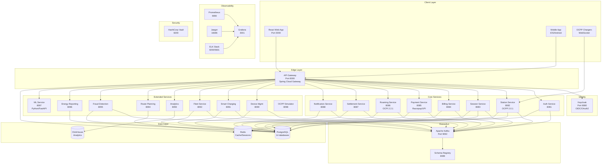
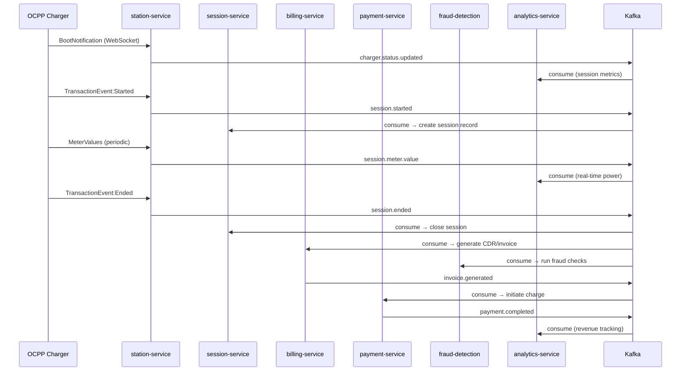
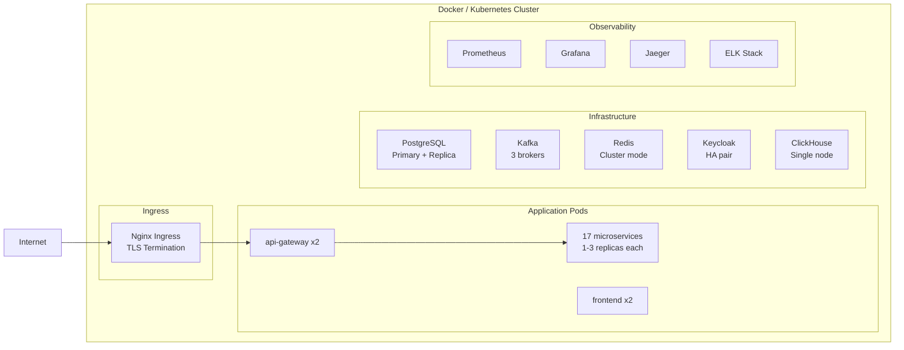

# EV Roaming Hub India — System Architecture

## Overview

EV Roaming Hub India is an enterprise-grade unified EV charging access platform connecting **17 microservices** across Charge Point Operators (CPOs) and Mobility Service Providers (MSPs).

---

## Microservice Architecture

---

## Kafka Event Flow

---

## Database Schema (Entity Relationships)

| Service | Database | Key Tables |
|---------|----------|------------|
| auth-service | evroaming_auth | users, rfid_cards, vehicles, audit_logs |
| station-service | evroaming_station | charging_stations, charge_points, connectors, cpo_networks |
| session-service | evroaming_session | charging_sessions, meter_values |
| billing-service | evroaming_billing | charge_detail_records, tariffs, invoices |
| payment-service | evroaming_payment | payments, wallet_transactions, refunds |
| roaming-service | evroaming_roaming | ocpi_tokens, location_cache, cpo_connections |
| settlement-service | evroaming_settlement | settlements, settlement_items |
| notification-service | evroaming_notification | notifications, notification_templates |
| device-management | evroaming_device | devices, device_configs, firmware_versions, health_logs |
| smart-charging | evroaming_smartcharging | charging_profiles, grid_load_metrics, power_limits |
| fleet-service | evroaming_fleet | fleets, fleet_vehicles, fleet_drivers, fleet_invoices |
| fraud-detection | evroaming_fraud | fraud_alerts, fraud_rules, fraud_rule_violations |
| energy-reporting | evroaming_energy | energy_reports, carbon_credits, tax_summaries |
| analytics-service | ClickHouse | session_events, meter_events, revenue_events |

---

## Deployment Architecture

---

## Security Architecture

| Layer | Implementation |
|-------|----------------|
| Authentication | Keycloak OIDC/OAuth2, JWT tokens |
| Service-to-service | JWT validation at API Gateway, mTLS (planned) |
| Secrets | HashiCorp Vault (dev mode), K8s Secrets (prod) |
| Rate limiting | Redis token bucket at API Gateway |
| Audit logging | Every auth event → Kafka → Elasticsearch |
| Charger identity | ISO 15118 certificate management (device-management-service) |

---

## API Endpoints Summary

| Service | Base Path | Swagger |
|---------|-----------|---------|
| api-gateway | `http://localhost:8000` | N/A (proxy) |
| auth-service | `/api/v1/auth` | `:8081/swagger-ui.html` |
| station-service | `/api/v1/stations` | `:8082/swagger-ui.html` |
| session-service | `/api/v1/sessions` | `:8083/swagger-ui.html` |
| billing-service | `/api/v1/billing` | `:8084/swagger-ui.html` |
| payment-service | `/api/v1/payments` | `:8085/swagger-ui.html` |
| roaming-service | `/ocpi/2.2.1` | `:8086/swagger-ui.html` |
| device-management | `/api/v1/devices` | `:8090/swagger-ui.html` |
| smart-charging | `/api/v1/smart-charging` | `:8091/swagger-ui.html` |
| fleet-service | `/api/v1/fleets` | `:8092/swagger-ui.html` |
| analytics-service | `/api/v1/analytics` | `:8093/swagger-ui.html` |
| route-planning | `/api/v1/route` | `:8094/swagger-ui.html` |
| fraud-detection | `/api/v1/fraud` | `:8095/swagger-ui.html` |
| energy-reporting | `/api/v1/reports` | `:8096/swagger-ui.html` |
| ml-service | `/api/v1/ml` | `:8097/docs` |
| ocpp-simulator | `/api/v1/simulator` | `:8098/swagger-ui.html` |
